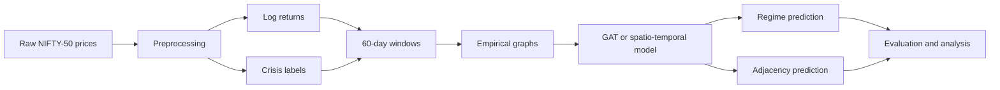
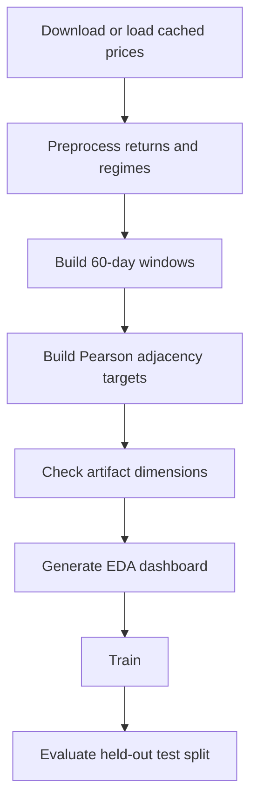
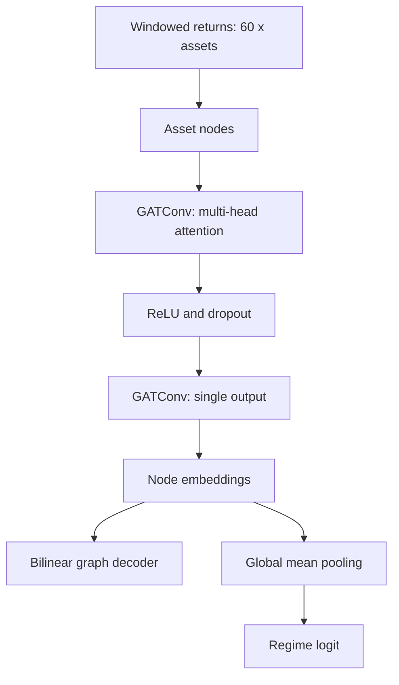

# Vortex-AI

Dynamic graph-based financial risk and regime-switching experiments using NIFTY-50 returns.

## Overview

Vortex-AI models NIFTY-50 assets as nodes in a dynamic graph. The pipeline creates return
windows, identifies crisis regimes, builds empirical adjacency targets, and trains either a
spatio-temporal baseline or a graph-attention model.



## Data Pipeline

Prepared artifacts live in `data/raw/`: `returns.npy`, `regimes.npy`, `windows.npy`,
`window_regimes.npy`, and `adj_matrices.npy`. The default window is 60 trading days.



## Setup and Usage

Run from the repository root:

```powershell
py -3 -m pip install -r requirements.txt
py -3 data/preprocess.py
py -3 -m src.data_processor
py -3 check_pipeline.py
py -3 eda_visualizations.py
```

The existing `data/graph_builder.py` includes optional Granger-causality calculations and
can be slow on the full dataset. The canonical `src.data_processor` path builds the
specification's Pearson-threshold targets directly.

Train and evaluate the models:

```powershell
py -3 -m training.trainer --epochs 50 --device cuda
py -3 -m training.gat_trainer --epochs 50 --device cuda
py -3 evaluate.py --device cuda
```

Use `--device cpu` for CPU execution. Checkpoints are saved under `models/checkpoints/`.

## Model Architecture

The baseline encodes each asset's return history with an LSTM. The GAT treats each asset as
a node whose features are its return history and applies two attention layers over a fully
connected graph.



## Measured Results

Recorded CUDA runs on the prepared dataset produced:

| Model | Best validation loss | Adjacency MSE | ROC-AUC | F1 |
| --- | ---: | ---: | ---: | ---: |
| Spatio-temporal baseline with binary adjacency loss | 0.8463 | 0.0694 | 0.5621 | 0.8465 |
| GAT | 0.6121 | 0.0829 | 0.8326 | 0.8465 |

The GAT improved regime ROC-AUC substantially in this run. The held-out adjacency MSE was
measured with `evaluate.py` against `models/checkpoints/best_gat_model.pt`.

## File Structure

```text
Vortex-AI/
├── data/                  # Downloading, preprocessing, graph construction, raw artifacts
├── eval/                  # Spillover, classification, and statistical utilities
├── models/                # Neural network components and checkpoints
├── notebooks/             # Interactive demo notebook
├── sandbox/               # Synthetic data, metrics, filters, and strategy backtests
├── src/                   # Specification-compatible processor and model API
├── training/              # Baseline and GAT training modules
├── check_pipeline.py      # Artifact integrity validation
├── eda_dashboard.py       # Five-panel EDA dashboard
├── eda_visualizations.py  # Backward-compatible EDA entry point
├── evaluate.py            # Held-out GAT evaluation
├── train.py               # Baseline training entry point
└── requirements.txt
```

## License

This project is licensed under the MIT License. See `LICENSE` for details.