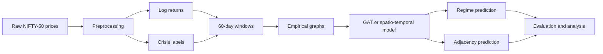
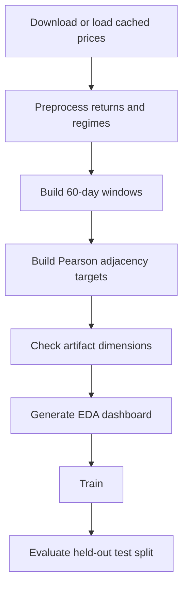
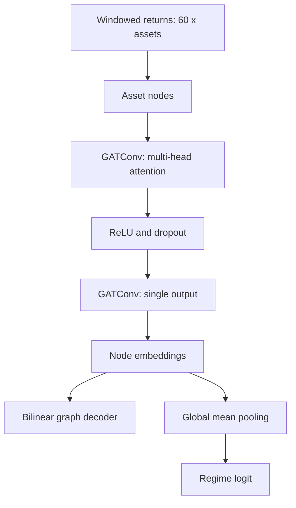

# Vortex-AI

Dynamic graph-based financial risk and regime-switching experiments using NIFTY-50 returns.

## What is this, in plain English?

Imagine you are watching the 50 biggest companies on India's NIFTY-50 stock market. On
calm days their share prices move independently, but during a crisis they tend to fall
together — the "contagion" effect, like a cold spreading through an office. Vortex-AI is a
research project that teaches a computer to:

1. Look at the last few months of price movements for all 50 companies at once.
2. Decide whether the market is currently calm ("normal") or stressed ("crisis").
3. Draw a "relationship map" showing which companies are moving together most tightly.

The computer learns this from history using neural networks (a type of AI loosely inspired
by the brain). The end goal is to better understand and anticipate moments of financial
stress, which matters for risk management, trading, and regulation.

You do **not** need to know finance or AI to run the project — the commands below handle
everything, and the results are saved as charts you can simply look at.

## Overview

Vortex-AI models NIFTY-50 assets as nodes in a dynamic graph. The pipeline creates return
windows, identifies crisis regimes, builds empirical adjacency targets, and trains either a
spatio-temporal baseline or a graph-attention model.



## Key concepts explained simply

These terms appear throughout the documentation. Each is explained in everyday language; the
precise definitions stay in the rest of the document.

- **NIFTY-50** — A basket of the 50 largest and most actively traded companies on India's
  National Stock Exchange. Think of it as a scoreboard for "how Indian big-business stocks
  are doing."
- **Return** — How much an asset's price went up or down over a period. A 2% return means
  the price rose 2%. "Log returns" are just a math-friendly way of writing those changes.
- **Regime** — The overall mood of the market in a given window: **normal** (calm) or
  **crisis** (stressed/high-volatility). The model tries to label each time window.
- **Window** — A fixed slice of recent history (here, **60 trading days**, about three
  months) that the model looks at, like reading the last 60 pages of a diary before guessing
  the mood.
- **Graph / adjacency matrix** — A "who-is-connected-to-whom" map. Each company is a dot
  (node); a line between two dots means their prices are strongly correlated (move together).
  The adjacency matrix is just that map written as a table of numbers.
- **GAT (Graph Attention Network)** — A neural network that, for each company, pays extra
  "attention" to the most relevant neighbours when making its prediction. Like a analyst
  focusing on the few stocks that actually influence the one they care about.
- **Spatio-temporal baseline (LSTM)** — A simpler neural network that reads each company's
  price history as a timeline (the "temporal" part) to make predictions.
- **ROC-AUC / F1** — Scores (0 to 1, higher is better) measuring how good the model is at
  telling crises apart from normal periods. 0.5 is a coin flip; 1.0 is perfect.
- **MSE (Mean Squared Error)** — An average "distance" between the predicted and real
  relationship maps; smaller means the map is closer to reality.

## Data Pipeline

Prepared artifacts live in `data/raw/`: `returns.npy`, `regimes.npy`, `windows.npy`,
`window_regimes.npy`, and `adj_matrices.npy`. The default window is 60 trading days.

In plain terms: the pipeline downloads price history, converts it into daily returns, tags
each day as calm or crisis, chops the timeline into 60-day chunks, and for every chunk draws
the "who-moves-with-whom" relationship map. Those maps and labels are what the models learn
from.



## Setup and Usage

Run from the repository root:

```powershell
py -3 -m pip install -r requirements.txt
py -3 data/preprocess.py
py -3 -m src.data_processor
py -3 check_pipeline.py
py -3 eda_visualizations.py
```

The existing `data/graph_builder.py` includes optional Granger-causality calculations and
can be slow on the full dataset. The canonical `src.data_processor` path builds the
specification's Pearson-threshold targets directly.

Train and evaluate the models:

```powershell
py -3 -m training.trainer --epochs 50 --device cuda
py -3 -m training.gat_trainer --epochs 50 --device cuda
py -3 evaluate.py --device cuda
```

Use `--device cpu` for CPU execution. Checkpoints are saved under `models/checkpoints/`.

A typical first run for a non-technical user: install dependencies, download/preprocess the
data once, run `check_pipeline.py` to confirm everything looks right, then open
`notebooks/demo.ipynb` to see the charts. Training is optional and can take a while.

## Model Architecture

The baseline encodes each asset's return history with an LSTM. The GAT treats each asset as
a node whose features are its return history and applies two attention layers over a fully
connected graph.

In plain terms: the baseline reads each company's recent price story one day at a time; the
GAT instead puts all companies on a "social network" and lets each one look at its neighbours
with weighted attention, then answers two questions — "what does the whole market map look
like?" and "is this a crisis?".



## Measured Results

Recorded CUDA runs on the prepared dataset produced:

| Model | Best validation loss | Adjacency MSE | ROC-AUC | F1 |
| --- | ---: | ---: | ---: | ---: |
| Spatio-temporal baseline with binary adjacency loss | 0.8463 | 0.0694 | 0.5621 | 0.8465 |
| GAT | 0.6121 | 0.0829 | 0.8326 | 0.8465 |

The GAT improved regime ROC-AUC substantially in this run. The held-out adjacency MSE was
measured with `evaluate.py` against `models/checkpoints/best_gat_model.pt`.

In plain terms: the graph-attention model (GAT) was much better at spotting crises
(ROC-AUC up from ~0.56, barely above a coin flip, to ~0.83) while still drawing a
relationship map almost as accurately as the baseline.

## File Structure

```text
Vortex-AI/
├── data/                  # Downloading, preprocessing, graph construction, raw artifacts
├── eval/                  # Spillover, classification, and statistical utilities
├── models/                # Neural network components and checkpoints
├── notebooks/             # Interactive demo notebook
├── sandbox/               # Synthetic data, metrics, filters, and strategy backtests
├── src/                   # Specification-compatible processor and model API
├── training/              # Baseline and GAT training modules
├── check_pipeline.py      # Artifact integrity validation
├── eda_dashboard.py       # Five-panel EDA dashboard
├── eda_visualizations.py  # Backward-compatible EDA entry point
├── evaluate.py            # Held-out GAT evaluation
├── train.py               # Baseline training entry point
└── requirements.txt
```

## Glossary

- **Adjacency (matrix)** — Numeric table representing the links/edges between asset nodes;
  high values mean two assets move together.
- **Bilinear / Bilinear graph decoder** — A learnable multiplication that turns two node
  representations into an edge score.
- **Binary cross-entropy / BCE** — Loss function for yes/no (crisis/normal) predictions.
- **Contagion / spillover** — The spread of shocks from one asset to others.
- **Correlation** — Statistical measure of how two things move together (positive = same
  direction, negative = opposite).
- **Dropout** — Training trick that randomly ignores parts of the network to prevent
  overfitting.
- **EDA (Exploratory Data Analysis)** — Looking at the data through charts before/after
  modelling.
- **Epoch** — One full pass through the training data.
- **Granger causality** — A statistical test for whether one time series helps predict
  another (lead-lag relationship).
- **Held-out test split** — Data the model never sees during training, used to measure real
  performance.
- **LSTM (Long Short-Term Memory)** — A neural network good at remembering patterns in
  sequences like price histories.
- **Pearson correlation** — Standard correlation coefficient between -1 and 1.
- **ReLU** — A simple "keep positive values, zero out negatives" activation function.
- **Regime logit** — The model's raw score for crisis-vs-normal before being turned into a
  probability.
- **Spatio-temporal** — Combining "space" (relationships between assets) and "time"
  (how they evolve).
- **Volume** — Number of shares traded; a liquidity/activity signal.

## License

This project is licensed under the MIT License. See `LICENSE` for details.
