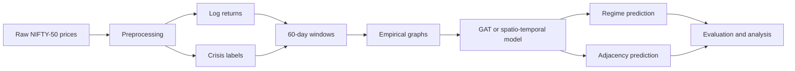
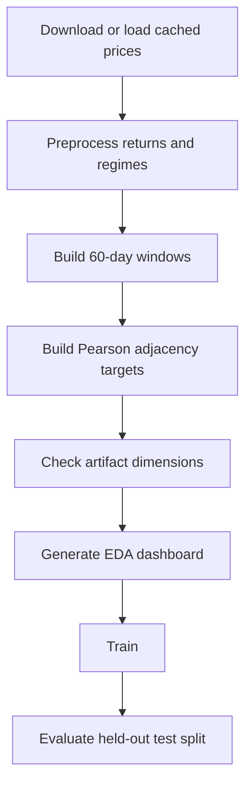
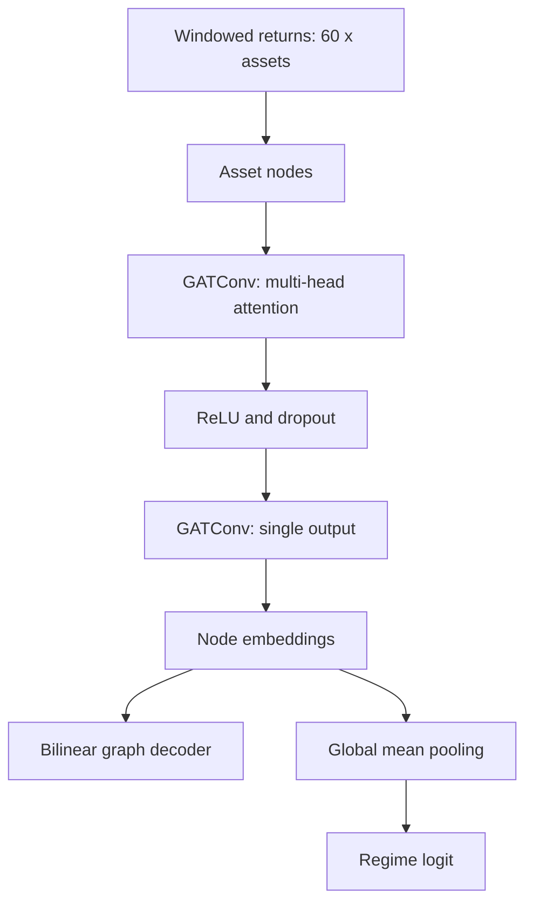

# VORTEX-AI (CG-NSDE)

**Contrastive Graph-Neural Stochastic Differential Equations for NSE Stress Testing**

A deep learning framework for generating synthetic NIFTY-50 market scenarios including realistic crashes by coupling dynamic Graph Attention Networks, Neural SDEs, and supervised contrastive regime separation with NSE-specific microstructure constraints.

## What is Vortex-AI

VORTEX-AI is a research framework that generates realistic synthetic stock market data for India's NIFTY-50 index, including both calm periods and financial crises. Unlike traditional models that treat stocks independently, VORTEX-AI models how stocks are connected during market stress (the "contagion effect") and enforces NSE-specific trading rules like circuit breakers.

**Key Innovation**: Combines three cutting-edge techniques:
1. **Dynamic Graph Attention** - Learns which stocks move together during different market conditions
2. **Neural Stochastic Differential Equations** - Generates realistic price paths with proper randomness
3. **Supervised Contrastive Learning** - Separates normal vs crisis regimes in latent space

This enables better stress testing, risk management, and trading strategy validation.

## Overview

Vortex-AI models NIFTY-50 assets as nodes in a dynamic graph. The pipeline creates return
windows, identifies crisis regimes, builds empirical adjacency targets, and trains either a
spatio-temporal baseline or a graph-attention model.


```mermaid
graph LR
	A[Raw NIFTY-50 prices] --> B[Preprocessing]
	B --> C[Log returns]
	B --> D[Crisis labels]
	C --> E[60-day windows]
	D --> E
	E --> F[Empirical graphs]
	F --> G[GAT or spatio-temporal model]
	G --> H[Regime prediction]
	G --> I[Adjacency prediction]
	H --> J[Evaluation and analysis]
	I --> J
```

## Key concepts explained simply

These terms appear throughout the documentation. Each is explained in everyday language; the
precise definitions stay in the rest of the document.

- **NIFTY-50** — A basket of the 50 largest and most actively traded companies on India's
  National Stock Exchange. Think of it as a scoreboard for "how Indian big-business stocks
  are doing."
- **Return** — How much an asset's price went up or down over a period. A 2% return means
  the price rose 2%. "Log returns" are just a math-friendly way of writing those changes.
- **Regime** — The overall mood of the market in a given window: **normal** (calm) or
  **crisis** (stressed/high-volatility). The model tries to label each time window.
- **Window** — A fixed slice of recent history (here, **60 trading days**, about three
  months) that the model looks at, like reading the last 60 pages of a diary before guessing
  the mood.
- **Graph / adjacency matrix** — A "who-is-connected-to-whom" map. Each company is a dot
  (node); a line between two dots means their prices are strongly correlated (move together).
  The adjacency matrix is just that map written as a table of numbers.
- **GAT (Graph Attention Network)** — A neural network that, for each company, pays extra
  "attention" to the most relevant neighbours when making its prediction. Like a analyst
  focusing on the few stocks that actually influence the one they care about.
- **Spatio-temporal baseline (LSTM)** — A simpler neural network that reads each company's
  price history as a timeline (the "temporal" part) to make predictions.
- **ROC-AUC / F1** — Scores (0 to 1, higher is better) measuring how good the model is at
  telling crises apart from normal periods. 0.5 is a coin flip; 1.0 is perfect.
- **MSE (Mean Squared Error)** — An average "distance" between the predicted and real
  relationship maps; smaller means the map is closer to reality.

## Data Pipeline

Prepared artifacts live in `data/raw/`: `returns.npy`, `regimes.npy`, `windows.npy`,
`window_regimes.npy`, and `adj_matrices.npy`. The default window is 60 trading days.

In plain terms: the pipeline downloads price history, converts it into daily returns, tags
each day as calm or crisis, chops the timeline into 60-day chunks, and for every chunk draws
the "who-moves-with-whom" relationship map. Those maps and labels are what the models learn
from.


```mermaid
flowchart TD
	A[Download or load cached prices] --> B[Preprocess returns and regimes]
	B --> C[Build 60-day windows]
	C --> D[Build Pearson adjacency targets]
	D --> E[Check artifact dimensions]
	E --> F[Generate EDA dashboard]
	F --> G[Train]
	G --> H[Evaluate held-out test split]
```

## Setup and Usage

Run from the repository root:

```powershell
py -3 -m pip install -r requirements.txt
py -3 data/preprocess.py
py -3 -m src.data_processor
py -3 check_pipeline.py
py -3 eda_visualizations.py
```

The existing `data/graph_builder.py` includes optional Granger-causality calculations and
can be slow on the full dataset. The canonical `src.data_processor` path builds the
specification's Pearson-threshold targets directly.

Train and evaluate the models:

```powershell
py -3 -m training.trainer --epochs 50 --device cuda
py -3 -m training.gat_trainer --epochs 50 --device cuda
py -3 evaluate.py --device cuda
```

Use `--device cpu` for CPU execution. Checkpoints are saved under `models/checkpoints/`.

A typical first run for a non-technical user: install dependencies, download/preprocess the
data once, run `check_pipeline.py` to confirm everything looks right, then open
`notebooks/demo.ipynb` to see the charts. Training is optional and can take a while.

## Model Architecture

The baseline encodes each asset's return history with an LSTM. The GAT treats each asset as
a node whose features are its return history and applies two attention layers over a fully
connected graph.

In plain terms: the baseline reads each company's recent price story one day at a time; the
GAT instead puts all companies on a "social network" and lets each one look at its neighbours
with weighted attention, then answers two questions — "what does the whole market map look
like?" and "is this a crisis?".


```mermaid
graph TB
	A[Windowed returns: 60 x assets] --> B[Asset nodes]
	B --> C[GATConv: multi-head attention]
	C --> D[ReLU and dropout]
	D --> E[GATConv: single output]
	E --> F[Node embeddings]
	F --> G[Bilinear graph decoder]
	F --> H[Global mean pooling]
	H --> I[Regime logit]
```

## Measured Results

Recorded CUDA runs on the prepared dataset produced:

| Model                                               | Best validation loss | Adjacency MSE | ROC-AUC |     F1 |
| --------------------------------------------------- | -------------------: | ------------: | ------: | -----: |
| Spatio-temporal baseline with binary adjacency loss |               0.8463 |        0.0694 |  0.5621 | 0.8465 |
| GAT                                                 |               0.6121 |        0.0829 |  0.8326 | 0.8465 |

The GAT improved regime ROC-AUC substantially in this run. The held-out adjacency MSE was
measured with `evaluate.py` against `models/checkpoints/best_gat_model.pt`.

In plain terms: the graph-attention model (GAT) was much better at spotting crises
(ROC-AUC up from ~0.56, barely above a coin flip, to ~0.83) while still drawing a
relationship map almost as accurately as the baseline.

## File Structure

```text
Vortex-AI/
├── data/                  # Downloading, preprocessing, graph construction, raw artifacts
├── eval/                  # Spillover, classification, and statistical utilities
├── models/                # Neural network components and checkpoints
├── notebooks/             # Interactive demo notebook
├── sandbox/               # Synthetic data, metrics, filters, and strategy backtests
├── src/                   # Specification-compatible processor and model API
├── training/              # Baseline and GAT training modules
├── check_pipeline.py      # Artifact integrity validation
├── eda_dashboard.py       # Five-panel EDA dashboard
├── eda_visualizations.py  # Backward-compatible EDA entry point
├── evaluate.py            # Held-out GAT evaluation
├── train.py               # Baseline training entry point
└── requirements.txt
```

## Glossary

- **Adjacency (matrix)** — Numeric table representing the links/edges between asset nodes;
  high values mean two assets move together.
- **Bilinear / Bilinear graph decoder** — A learnable multiplication that turns two node
  representations into an edge score.
- **Binary cross-entropy / BCE** — Loss function for yes/no (crisis/normal) predictions.
- **Contagion / spillover** — The spread of shocks from one asset to others.
- **Correlation** — Statistical measure of how two things move together (positive = same
  direction, negative = opposite).
- **Dropout** — Training trick that randomly ignores parts of the network to prevent
  overfitting.
- **EDA (Exploratory Data Analysis)** — Looking at the data through charts before/after
  modelling.
- **Epoch** — One full pass through the training data.
- **Granger causality** — A statistical test for whether one time series helps predict
  another (lead-lag relationship).
- **Held-out test split** — Data the model never sees during training, used to measure real
  performance.
- **LSTM (Long Short-Term Memory)** — A neural network good at remembering patterns in
  sequences like price histories.
- **Pearson correlation** — Standard correlation coefficient between -1 and 1.
- **ReLU** — A simple "keep positive values, zero out negatives" activation function.
- **Regime logit** — The model's raw score for crisis-vs-normal before being turned into a
  probability.
- **Spatio-temporal** — Combining "space" (relationships between assets) and "time"
  (how they evolve).
- **Volume** — Number of shares traded; a liquidity/activity signal.

## License

This project is licensed under the MIT License. See `LICENSE` for details.


## Quick Start (VORTEX-AI CG-NSDE)

### 1. Installation

```bash
# Clone repository
git clone <repository-url>
cd Vortex-AI

# Create virtual environment
python -m venv venv
source venv/bin/activate  # On Windows: venv\Scripts\activate

# Install dependencies
pip install -r requirements.txt
```

### 2. Data Preparation

```bash
# Download NIFTY-50 historical data
python data/download.py

# Preprocess returns and compute regimes
python data/preprocess.py

# Build graph adjacency matrices
python -m src.data_processor

# Verify pipeline
python check_pipeline.py
```

### 3. Training

```bash
# Train VORTEX-AI model (with wandb logging)
python train_vortex.py --config training/config.yaml

# Train on CPU
python train_vortex.py --config training/config.yaml --accelerator cpu

# Resume from checkpoint
python train_vortex.py --resume models/checkpoints/last.ckpt

# Override hyperparameters
python train_vortex.py --batch_size 16 --max_epochs 100 --lam_con 0.2
```

### 4. Evaluation

```bash
# Run comprehensive evaluation
python evaluate_vortex.py --checkpoint models/checkpoints/best_vortex.ckpt

# Generate 500 scenarios for testing
python evaluate_vortex.py --checkpoint models/checkpoints/best_vortex.ckpt --n_scenarios 500

# Include Granger causality test (slow)
python evaluate_vortex.py --checkpoint models/checkpoints/best_vortex.ckpt --test_granger
```

### 5. Visualization

```bash
# Generate all visualizations (fan charts, heatmaps, P&L distributions)
python visualize_results.py --checkpoint models/checkpoints/best_vortex.ckpt

# Custom output directory
python visualize_results.py --checkpoint models/checkpoints/best_vortex.ckpt --output_dir results/my_figures
```

## Architecture Overview

```
┌─────────────────────────────────────────────────────────────┐
│  VORTEX-AI (CG-NSDE) Architecture                           │
├─────────────────────────────────────────────────────────────┤
│                                                               │
│  Input: 60-day window of returns (B, T=60, N=50)            │
│         + 6-dim node features per stock                      │
│                                                               │
│  ┌─────────────────────────────────────────────────┐        │
│  │  Block 1: Dynamic GAT Encoder                   │        │
│  │  • 2-layer GAT (4 heads → 1 head)              │        │
│  │  • Learns dynamic adjacency A_t                 │        │
│  │  • Output: node_embs (B, N, 64)                │        │
│  └─────────────────────────────────────────────────┘        │
│                      ↓                                        │
│  ┌─────────────────────────────────────────────────┐        │
│  │  Block 2: Latent Encoder (GRU)                 │        │
│  │  • Encodes window → z_0 (B, 64)                │        │
│  └─────────────────────────────────────────────────┘        │
│                      ↓                                        │
│  ┌─────────────────────────────────────────────────┐        │
│  │  Block 3: Graph-Conditioned Neural SDE         │        │
│  │  • dX_t = μ(X_t,G_t,t)dt + σ(X_t,G_t,t)dW_t  │        │
│  │  • Euler-Maruyama integration                   │        │
│  │  • Output: latent paths (B, T, 64)             │        │
│  └─────────────────────────────────────────────────┘        │
│                      ↓                                        │
│  ┌─────────────────────────────────────────────────┐        │
│  │  Block 4: Contrastive Regime Head              │        │
│  │  • Temporal pooling + projection                │        │
│  │  • SupCon loss (τ=0.07)                        │        │
│  │  • Forces crisis/normal separation              │        │
│  └─────────────────────────────────────────────────┘        │
│                      ↓                                        │
│  ┌─────────────────────────────────────────────────┐        │
│  │  Block 5: Decoder + Circuit Filter             │        │
│  │  • Linear decode → returns (B, T, N)           │        │
│  │  • NSE bands: ±5%, ±10%, ±20%                 │        │
│  └─────────────────────────────────────────────────┘        │
│                                                               │
│  Loss: λ_rec·L_rec + λ_graph·L_graph + λ_con·L_con         │
└─────────────────────────────────────────────────────────────┘
```

## Evaluation Metrics

VORTEX-AI is evaluated against the following targets (from masterplan):

| Metric | Target | Description |
|--------|--------|-------------|
| **Kurtosis** | > 3.0 | Fat tails (excess kurtosis) |
| **ACF(r²)** | > 0.05 | Volatility clustering |
| **Correlation Error** | < 2.5 | Frobenius norm vs empirical |
| **Discriminative Score** | < 0.60 | GBC classifier accuracy (lower = better) |
| **Crisis Correlation Boost** | > 50% | Increase during crisis vs normal |
| **CVaR Ratio** | > 3x | Crisis CVaR / Normal CVaR |

## Configuration

Key hyperparameters in `training/config.yaml`:

```yaml
# Model architecture
latent_dim: 64
proj_dim: 32
gat_heads: 4
hidden_dim: 64

# Training
batch_size: 32
learning_rate: 0.001
max_epochs: 200
gradient_clip_val: 1.0

# Loss weights
lam_rec: 1.0      # Reconstruction
lam_graph: 0.1    # Graph consistency
lam_con: 0.1      # Contrastive
tau: 0.07         # SupCon temperature

# Regime labeling
crisis_percentile: 85  # Top 15% as crisis
```

## Project Structure (VORTEX-AI)

```
Vortex-AI/
├── data/
│   ├── download.py              # Fetch NIFTY-50 data via yfinance
│   ├── preprocess.py            # Compute returns & regimes
│   ├── graph_builder.py         # Build adjacency matrices
│   └── raw/                     # Generated .npy arrays
│
├── models/
│   ├── gat_encoder.py           # DynamicGATEncoder (2-layer GAT)
│   ├── neural_sde.py            # GraphConditionedSDE + LatentSDEModel
│   ├── contrastive.py           # SupConLoss + ProjectionHead
│   ├── decoder.py               # Graph decoder (legacy)
│   └── checkpoints/             # Saved model weights
│
├── training/
│   ├── vortex_model.py          # PyTorch Lightning VORTEXModel
│   ├── losses.py                # All loss components
│   ├── trainer.py               # Legacy baseline trainer
│   ├── gat_trainer.py           # Legacy GAT trainer
│   └── config.yaml              # Hyperparameters
│
├── eval/
│   ├── statistical.py           # Kurtosis, ACF, correlation tests
│   ├── discriminative.py        # GBC classifier score
│   └── contagion.py             # Crisis correlation, CVaR tests
│
├── sandbox/
│   ├── circuit_filter.py        # NSE circuit breaker enforcement
│   ├── generate.py              # Scenario generation utilities
│   ├── strategy.py              # Trading strategy backtests
│   └── metrics.py               # Additional metrics
│
├── notebooks/
│   ├── demo.ipynb               # Interactive demo
│   └── vortexai.ipynb           # Analysis notebook
│
├── train_vortex.py              # Main training script
├── evaluate_vortex.py           # Comprehensive evaluation
├── visualize_results.py         # Generate figures
├── check_pipeline.py            # Data validation
├── requirements.txt             # Dependencies
└── README.md                    # This file
```

## Key Features

### 1. Dynamic Graph Attention Network
- 2-layer GAT with multi-head attention (4 heads → 1 head)
- Learns time-varying adjacency matrices representing stock correlations
- Captures sector contagion (e.g., Banking → IT during crises)

### 2. Graph-Conditioned Neural SDE
- Drift and diffusion networks conditioned on graph embeddings
- Euler-Maruyama integration with dt=1/60
- Generates continuous-time stochastic paths

### 3. Supervised Contrastive Loss
- Forces crisis and normal regimes to separate in latent space
- Temperature τ=0.07 (Khosla et al. 2020 standard)
- Prevents mode collapse

### 4. NSE Circuit Breakers
- Band A: ±5% (high liquidity stocks like SBI, Tata Motors)
- Band B: ±10% (most NIFTY-50 stocks)
- Band C: ±20% (less liquid stocks)
- Both hard clipping (post-generation) and soft penalty (training)

## Citation

If you use this code in your research, please cite:

```bibtex
@software{vortex_ai_2026,
  title={VORTEX-AI: Contrastive Graph-Neural Stochastic Differential Equations for Financial Stress Testing},
  author={Your Name},
  year={2026},
  url={https://github.com/yourusername/Vortex-AI}
}
```

## References

Key papers and resources:

1. **TimeGAN** (Yoon et al., NeurIPS 2019) - Baseline generative model
2. **torchsde** (Li et al., NeurIPS 2021) - Neural SDE solver
3. **Supervised Contrastive Learning** (Khosla et al., 2020) - SupCon loss formulation
4. **Graph Attention Networks** (Veličković et al., ICLR 2018) - GAT architecture
5. **NSE Circuit Breaker Rules** - Official NSE documentation

## Legacy Baselines

The repository also includes legacy baseline implementations:

```bash
# Train spatio-temporal LSTM baseline
python -m training.trainer --epochs 50 --device cuda

# Train legacy GAT baseline
python -m training.gat_trainer --epochs 50 --device cuda

# Evaluate legacy models
python evaluate.py --device cuda
```
